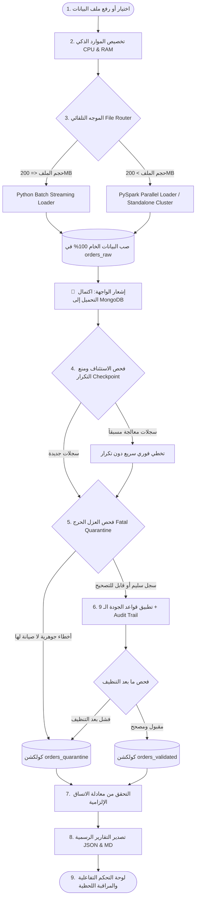

# 🚀 Hybrid ELT Big Data Pipeline (Path A: Spark Standalone Cluster)

[](https://www.python.org/)
[](https://spark.apache.org/)
[](https://www.mongodb.com/)
[](https://flask.palletsprojects.com/)
[](LICENSE)

مشروع خط البيانات الهجين المتكامل (**Hybrid ELT Data Pipeline**) لمعالجة وتنظيف وضمان جودة البيانات الضخمة (Big Data) لمتجر إلكتروني عملاق (~30,000,000 سجل / 12.6GB) باستخدام **Python Batch Streaming** و **Apache Spark (المسار A المتقدم: Standalone Cluster)** و **MongoDB**.

---

## 📑 فهرس المحتويات
- [🏛️ المعمارية العامة (Architecture)](#-المعمارية-العامة-architecture)
- [✨ المميزات الرئيسية (Key Features)](#-المميزات-الرئيسية-key-features)
- [🧹 قواعد التنظيف والجودة الـ 9 (9 Quality Rules)](#-قواعد-التنظيف-والجودة-الـ-9-9-quality-rules)
- [📐 معادلة الاتساق الإلزامية (Consistency Formula)](#-معادلة-الاتساق-الإلزامية-consistency-formula)
- [📁 هيكل المجلدات (Project Structure)](#-هيكل-المجلدات-project-structure)
- [🚀 خطوات التثبيت والتشغيل (Quick Start)](#-خطوات-التثبيت-والتشغيل-quick-start)
- [📊 لوحة التحكم التفاعلية (Web Dashboard)](#-لوحة-التحكم-التفاعلية-web-dashboard)
- [🧪 تشغيل الاختبارات (Unit Tests)](#-تشغيل-الاختبارات-unit-tests)

---

## 🏛️ المعمارية العامة (Architecture)

يعتمد المشروع معمارية **ELT (Extract - Load - Transform)** الحقيقية للبيانات الضخمة:



---

## ✨ المميزات الرئيسية (Key Features)

1. **الموجّه الذكي للملفات (Dynamic File Router)**:
   - حد الـ **200MB** (المطابق لمعايير المقرر):
     - $\le 200\text{ MB}$: يوجّه إلى `Python Batch Loader` (قراءة تدفقية سطر بسطر عبر `csv.DictReader` بدون تحميل الذاكرة).
     - $> 200\text{ MB}$: يوجّه إلى `PySpark Loader` (توزيع وتقسيم متوازي عبر Partitions على عنقود Spark Standalone).

2. **تخصيص الموارد ومراقبة الـ RAM اللحظية**:
   - حجز نواة واحدة لنظام التشغيل، وتخصيص $N-1$ نواة للمعالجة.
   - تخصيص 80% من الذاكرة وحساب حجم الدفعة (`dynamic_batch_size`) ديناميكياً.
   - مراقبة حية للذاكرة المستهلكة والشاغرة للجهاز لحظة بلحظة على الواجهة.

3. **منع التكرار وضمان الـ Idempotency**:
   - إنشاء فهارس فريدة (`Unique Index`) على `order_id` في `orders_validated` و `orders_quarantine`.
   - استخدام `bulk_write` مع `UpdateOne(..., upsert=True)`، مما يضمن استئناف العمليات وتخطي السجلات المعالجة مسبقاً دون أي تكرار.

4. **تحديد عدد السجلات واختيار القواعد المخصصة (Interactive Filters)**:
   - إمكانية تحديد عدد السجلات المراد معالجتها (Limit / Max Rows) للتجربة السريعة.
   - واجهة لاختيار وتفعيل أو إلغاء أي قاعدة تنظيف أو عزل بضغطة زر.

---

## 🧹 قواعد التنظيف والجودة الـ 9 (9 Quality Rules)

| رقم القاعدة | اسم القاعدة | الوصف والعملية المطبقة |
| :---: | :--- | :--- |
| **Rule 1** | Phone Normalization | إزالة الرموز وتوحيد مفتاح الهاتف لليمن (`+967XXXXXXXXX`). |
| **Rule 2** | City & District Cleanup | توحيد أسماء المدن والمحافظات وتصحيح الأخطاء الإملائية الشائعة. |
| **Rule 3** | Date Standardization | تحويل وتوحيد كافة التواريخ المختلفة إلى صيغة قياسية ISO `YYYY-MM-DD`. |
| **Rule 4** | Status & Delivery Cleanup | توحيد حالات الطلب (`DELIVERED`, `CANCELLED`...) وطرق التوصيل. |
| **Rule 5** | Payment Cleanup | تصحيح وتوحيد طرق الدفع ومطابقة المبالغ المدفوعة. |
| **Rule 6** | Items JSON Parsing | فك تشفير مصفوفات JSON، وتصحيح الأسعار وحساب `subtotal = price * qty`. |
| **Rule 7** | Financial Recalculation | التحقق من صحة إجمالي الطلب ومطابقته المالية (`Total = Subtotal + Delivery`). |
| **Rule 8** | Currency Unification | تحويل وتوحيد كافة العملات المختلفة إلى العملة الرسمية (`YER`). |
| **Rule 9** | Email Cleanup | تصحيح وتنظيف صيغ البريد الإلكتروني غير الصالحة. |

> 📝 **سجل التدقيق (Audit Trail)**: توثق كافة العمليات المصححة مع تسجيل القيمة الأصلية والقيمة المعدلة واسم القاعدة وسبب التعديل داخل مصفوفة `corrections` في كل سجل.

---

## 📐 معادلة الاتساق الإلزامية (Consistency Formula)

يطبق النظام تدقيقاً رياضياً صارماً للتحقق من سلامة كافة السجلات:

$$\text{Total Raw Records} = \text{Valid Records} + \text{Corrected Records} + \text{Quarantined Records}$$

يتم حفظ نتيجة التحقق رسمياً في التقرير: [`reports/results.json`](reports/results.json) و [`reports/results.md`](reports/results.md).

---

## 📁 هيكل المجلدات (Project Structure)

```text
midterm-data-pipeline/
├── README.md                         # دليل المشروع الشامل
├── WORKFLOW.md                       # وثيقة سير العمل التفصيلية والدوال
├── requirements.txt                  # متطلبات ومكتبات المشروع
├── config/
│   └── settings.py                   # إعدادات النظام وقاعدة البيانات
├── data/
│   ├── .gitkeep                      # مجلد البيانات
│   └── orders_sample_small.csv       # عينة صغيرة تجريبية للاختبار السريع
├── src/
│   ├── main.py                       # نقطة التشغيل الرئيسية
│   ├── file_router.py                # موجه حجم الملفات التلقائي (200MB)
│   ├── batch_loader.py               # محمّل بايثون بالدفعات (Streaming)
│   ├── spark_loader.py               # محمّل PySpark المتقدم (Path A)
│   ├── quality_rules.py              # قواعد الجودة الـ 9 وسجل التدقيق
│   ├── elt_pipeline.py               # المحرك التنفيذي لخط المعالجة
│   ├── mongo_setup.py                # إعداد اتصالات وفهارس MongoDB
│   ├── resource_manager.py           # تخصيص الموارد ومراقبة الجهاز
│   ├── metrics.py                    # توليد التقارير ومعادلة الاتساق
│   ├── web_app.py                    # سيرفر لوحة التحكم (Flask API)
│   ├── static/                       # ملفات التنسيق والسكربتات (CSS & JS)
│   └── templates/                    # واجهة المستخدم (HTML5)
├── tests/
│   ├── test_cleaning_rules.py        # اختبارات قواعد التنظيف الـ 9
│   └── test_classification.py        # اختبارات التصنيف ومعادلة الاتساق
└── reports/
    ├── results.json                  # النتائج الرقمية الرسمية (JSON)
    └── results.md                    # تقرير النتائج النهائي (Markdown)
```

---

## 🚀 خطوات التثبيت والتشغيل (Quick Start)

### 1. استنساخ المشروع (Clone Repository):
```bash
git clone https://github.com/YOUR_USERNAME/midterm-data-pipeline.git
cd midterm-data-pipeline
```

### 2. إنشاء البيئة الافتراضية وتثبيت المكتبات:
```bash
python -m venv venv
# تفعيل البيئة:
# Windows (PowerShell):
.\venv\Scripts\Activate.ps1
# Linux / macOS:
source venv/bin/activate

# تثبيت المتطلبات:
pip install -r requirements.txt
```

### 3. تشغيل لوحة التحكم التفاعلية (Web UI):
```bash
python run_web_ui.py
```
ثم افتح المتصفح على الرابط: 👉 **`http://127.0.0.1:5000`**

### 4. التشغيل من سطر الأوامر (CLI):
```bash
# تشغيل الملف الافتراضي:
python src/main.py

# تشغيل عينة صغيرة تجريبية:
python src/main.py --sample

# تشغيل مع تصفير قاعدة البيانات:
python src/main.py --reset
```

---

## 📊 لوحة التحكم التفاعلية (Web Dashboard)

تتميز لوحة التحكم بالآتي:
- **كشف تلقائي للملفات**: فحص حجم الملف وتحديد عدد السجلات تلقائياً.
- **تخصيص القواعد**: تفعيل أو إلغاء أي قاعدة تنظيف أو عزل حسب الرغبة.
- **تحديد السجلات**: إمكانية تحديد عدد السجلات المراد معالجتها (Limit).
- **عدادات حية**: متابعة السجلات المعالجة والمتبقية والإجمالية لحظة بلحظة.
- **مراقبة الموارد**: قراءة استهلاك الرام (المستخدمة والمتبقية للجهاز).
- **رسوم بيانية**: مخططات تفاعلية لأسباب العزل وأكثر قواعد الجودة تطبيقاً.

---

## 🧪 تشغيل الاختبارات (Unit Tests)

للتأكد من سلامة كافة القواعد ودوال النظام:
```bash
pytest tests/ -v
```

---

## 👨‍💻 إشراف وإعداد:
- **المقرر**: بيانات ضخمة (Big Data Course — Midterm Project)
- **المسار**: Path A (Spark Standalone Cluster & Python Hybrid ELT)
- **الجامعة**: جامعة الرازي (Al-Razi University)
