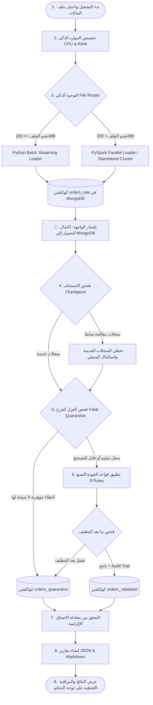

# وثيقة سير العمل والدوال المستخدمة — Hybrid ELT Pipeline
## Big Data Course — Midterm Project (Path A: Spark Standalone Cluster)

---

## 📑 فهرس المحتويات
1. [نظرة عامة على معمارية النظام (System Architecture)](#1-نظرة-عامة-على-معمارية-النظام)
2. [مخطط سير العمل الشامل (End-to-End Workflow Diagram)](#2-مخطط-سير-العمل-الشامل)
3. [المراحل التفصيلية والدوال المستخدمة لكل مرحلة](#3-المراحل-التفصيلية-والدوال-المستخدمة)
   - [المرحلة 0: فحص وتخصيص الموارد الديناميكي](#المرحلة-0-فحص-وتخصيص-الموارد-الديناميكي)
   - [المرحلة 1: الفحص والتوجيه التلقائي للملفات](#المرحلة-1-الفحص-والتوجيه-التلقائي-للملفات)
   - [المرحلة 2: صب وتفريغ البيانات الخام (Extract & Load - EL)](#المرحلة-2-صب-وتفريغ-البيانات-الخام-el)
   - [المرحلة 3: التحول، التنظيف، وقواعد الجودة (Transform - T)](#المرحلة-3-التحول-التنظيف-وقواعد-الجودة-t)
   - [المرحلة 4: التدقيق ومعادلة الاتساق والتقارير (Audit & Reporting - R)](#المرحلة-4-التدقيق-ومعادلة-الاتساق-والتقارير-r)
   - [المرحلة 5: لوحة التحكم التفاعلية والمراقبة اللحظية (Web Dashboard)](#المرحلة-5-لوحة-التحكم-التفاعلية-والمراقبة-اللحظية)
4. [جدول الدوال والملفات المرجعي الشامل (Reference Table)](#4-جدول-الدوال-والملفات-المرجعي-الشامل)

---

## 1. نظرة عامة على معمارية النظام

يعتمد المشروع معمارية **ELT (Extract - Load - Transform)** للبيانات الضخمة:
* **Extract & Load (EL)**: قراءة البيانات الخام من ملفات الـ CSV وحفظها كما هي تماماً 100% في كولكشن `orders_raw` في قاعدة بيانات MongoDB دون أي تعديل مسبق.
* **Transform (T)**: قراءة السجلات من `orders_raw`، وتطبيق فحوصات العزل الحرج وقواعد الجودة التسع (9 Quality Rules)، وتسجيل أثر التعديلات (Audit Trail)، ثم حفظ السجلات المصنفة إما في `orders_validated` أو `orders_quarantine`.
* **Report (R)**: التحقق من معادلة الاتساق الإلزامية وحساب السرعة والإنتاجية وتوليد التقارير القياسية `results.json` و `results.md`.

---

## 2. مخطط سير العمل الشامل



---

## 3. المراحل التفصيلية والدوال المستخدمة

### المرحلة 0: فحص وتخصيص الموارد الديناميكي
* **الملف المسئول**: `src/resource_manager.py`
* **الهدف**: فحص موارد الجهاز في لحظة التشغيل وتخصيص الأنوية والذاكرة وحجم الدفعات لمنع تجمّد النظام.

#### 🔧 الدوال المستخدمة:
1. `get_optimal_resources(mem_fraction=0.8, leave_cores=1)`:
   - **المدخلات**: نسبة الذاكرة المتاحة المراد تخصيصها، وعدد الأنوية المحجوزة للنظام.
   - **العملية**: تفحص `os.cpu_count()` و `psutil.virtual_memory()`، تحسب عدد الأنوية المخصصة للمعالجة، والذاكرة المخصصة بالـ GB وصيغة Spark (`8g`)، وحجم الدفعة الديناميكي (`dynamic_batch_size`).
   - **المخرجات**: قاموس يحتوي على تفاصيل الموارد المحسوبة.

2. `get_live_ram_stats()`:
   - **العملية**: تقرأ الذاكرة الحية للجهاز في الوقت الفعلي (`mem.used`, `mem.available`, `mem.percent`).
   - **المخرجات**: تفاصيل الـ RAM المستخدمة والمتبقية الشاغرة للجهاز لإظهارها على لوحة التحكم لحظياً.

---

### المرحلة 1: الفحص والتوجيه التلقائي للملفات
* **الملف المسئول**: `src/file_router.py`
* **الهدف**: قياس حجم الملف وتحديد المسار الأنسب تلقائياً بناءً على حد الـ 200MB (قسم 6.2).

#### 🔧 الدوال المستخدمة:
1. `route_file(file_path, resources)`:
   - **المدخلات**: مسار ملف البيانات، وقاموس الموارد المخصصة.
   - **العملية**:
     - تفحص حجم الملف بالـ MB:
       - إذا كان الحجم $\le$ 200MB: تستدعي `load_csv_in_batches` من `python_batch_loader.py`.
       - إذا كان الحجم $>$ 200MB: تستدعي `load_csv_with_spark` من `spark_loader.py`.
   - **المخرجات**: `(loader_name, raw_count, file_size_mb)`.

---

### المرحلة 2: صب وتفريغ البيانات الخام (Extract & Load - EL)
* **الملفات المسئولة**:
  - `src/python_batch_loader.py`
  - `src/spark_loader.py`
  - `src/mongo_setup.py`
* **الهدف**: قراءة ملف الـ CSV وتفريغ السجلات كما هي تماماً في كولكشن `orders_raw`.

#### 🔧 الدوال المستخدمة:
1. `load_csv_in_batches(csv_path, batch_size)` في `src/python_batch_loader.py`:
   - **العملية**: قراءة تدفقية لملفات الـ CSV الصغيرة والمتوسطة باستخدام مكتبة `csv` في بايثون، وصبها على دفعات سريعة باستخدام `insert_many` في `orders_raw`.
   - **المخرجات**: إجمالي عدد السجلات الخام المحملة.

2. `load_csv_with_spark(csv_path, resources)` في `src/spark_loader.py`:
   - **العملية**: إنشاء جلسة `SparkSession` مع الاتصال بـ Standalone Cluster (`SPARK_MASTER_URL`)، وتقسيم الملف إلى Partitions متوازية، وكتابتها بكفاءة عالية إلى `orders_raw`.
   - **المخرجات**: إجمالي عدد السجلات الخام المحملة.

3. `setup_indexes()` في `src/mongo_setup.py`:
   - **العملية**: إنشاء الفهارس الفريدة (`Unique Indexes`) على حقل `order_id` في كولكشنات `orders_validated` و `orders_quarantine` لضمان منع التكرار (Idempotency).

4. `drop_raw_collection()` و `reset_all_collections()` في `src/mongo_setup.py`:
   - **العملية**: تفريغ كولكشن `orders_raw` قبل التحميل الجديد، أو تصفير جميع الكولكشنات عند اختيار `--reset`.

---

### المرحلة 3: التحول، التنظيف، وقواعد الجودة (Transform - T)
* **الملفات المسئولة**:
  - `src/elt_pipeline.py`
  - `src/quality_rules.py`
  - `src/mongo_setup.py`
* **الهدف**: قراءة السجلات من `orders_raw`، وتخطي السجلات المعالجة مسبقاً، وتطبيق قواعد الجودة التسع، وتوثيق سجل التدقيق (Audit Trail)، وعزل السجلات التالفة.

#### 🔧 الدوال المستخدمة في `src/quality_rules.py`:
1. `check_fatal_quarantine(record)`:
   - فحص الأخطاء الجوهرية قبل التنظيف (`order_id` مفقود، `customer_id` مفقود، `items_json` تالف).

2. **قواعد الجودة التسع (9 Rules)**:
   - `rule_1_phone_normalization(phone)`: إزالة الرموز وتوحيد مفتاح الدولة لليمن (`+967`).
   - `rule_2_city_district_cleanup(city, district)`: توحيد أسماء المدن والأحياء وتصحيح الأخطاء الإملائية.
   - `rule_3_date_standardization(date_str)`: توحيد صيغ التواريخ المختلفة إلى صيغة قياسية ISO `YYYY-MM-DD`.
   - `rule_4_status_delivery_cleanup(status, delivery_type)`: توحيد حالات الطلب وطرق التوصيل.
   - `rule_5_payment_cleanup(payment_method, payment_status, payment_amount, total_amount)`: تصحيح وتوحيد طرق وحالات الدفع والمبالغ المدفوعة.
   - `rule_6_items_json_parsing_and_recalc(items_raw)`: فك تشفير مصفوفة الـ JSON، وحساب `subtotal = item_price * item_quantity` لكل عنصر.
   - `rule_7_financial_recalculation(items, delivery_cost, total_amount, payment_amount)`: التحقق من إجمالي الطلب ومطابقته مع مجموع العناصر وتكلفة التوصيل.
   - `rule_8_currency_unification(currency, total_amount, delivery_cost, payment_amount, items)`: تحويل وتوحيد كافة المبالغ إلى العملة المستهدفة (`YER`).
   - `rule_9_email_cleanup(email, customer_name)`: تنظيف وتصحيح صيغ البريد الإلكتروني.

3. `apply_all_rules(raw_record)`:
   - تطبيق القواعد التسع بالترتيب، وتجميع كافة التعديلات في مصفوفة `corrections` (سجل التدقيق Audit Trail).

4. `check_post_cleaning_quarantine(cleaned_record)`:
   - التحقق النهائي بعد التنظيف لعزل أي سجل بقي سعره غير معروف أو يحتوي على قيم سالبة غير قابلة للتصحيح.

5. `build_quarantine_doc(record, error_code, run_id)`:
   - بناء مستند كولكشن `orders_quarantine` مع سبب العزل وتاريخ المعالجة بتوقيت UTC.

6. `build_validated_doc(cleaned_record, items, corrections, run_id)`:
   - بناء مستند كولكشن `orders_validated` الموثق مع سجل التدقيق وقيمة `quality_status` (`valid` أو `corrected`).

#### 🔧 الدوال المستخدمة في `src/elt_pipeline.py`:
1. `run_elt_pipeline(csv_path=None, reset=False, progress_callback=None)`:
   - المحرك الرئيسي التنسيقي:
     - يجلب معرفات الطلبات المكتملة مسبقاً عبر Cursor projection:
       ```python
       processed_validated_ids = {doc["order_id"] for doc in validated_collection.find({}, {"order_id": 1, "_id": 0})}
       ```
     - يرسل إشعار اكتمال التحميل إلى MongoDB للواجهة.
     - يعالج السجلات على دفعات باستخدام Cursors ويتخطى السجلات المعالجة سابقاً (الاستئناف التلقائي).
     - يستدعي دوال الـ Bulk Upsert لحفظ البيانات بشكل آمن ومقاوم للانقطاع:
       - `bulk_upsert_validated(batch)`
       - `bulk_upsert_quarantine(batch)`

---

### المرحلة 4: التدقيق ومعادلة الاتساق والتقارير (Audit & Reporting - R)
* **الملف المسئول**: `src/metrics.py`
* **الهدف**: التحقق من المعادلة الرياضية الإلزامية وتصدير التقارير القياسية للتشغيل.

#### 🔧 الدوال المستخدمة:
1. `generate_and_save_metrics(run_id, loader_name, file_size_mb, raw_count, stats, resources, start_time, end_time, file_path)`:
   - **العملية**:
     - تتحقق من معادلة الاتساق الإلزامية (قسم 6.11):
       $$\text{run\_raw} = \text{run\_valid} + \text{run\_corrected} + \text{run\_quarantine}$$
     - تحسب مدة التشغيل بالثواني، ومعدل السرعة (Throughput: سجل/ثانية).
     - تحسب عدد السجلات المضافة الجديدة مقابل السجلات المعالجة سابقاً في حالات الاستئناف.
     - تصدر ملف التقرير القياسي بصيغة JSON إلى `reports/results.json`.
     - تصدر وثيقة التقرير الشاملة بصيغة Markdown إلى `reports/results.md`.
   - **المخرجات**: قاموس التقرير المكتمل.

---

### المرحلة 5: لوحة التحكم التفاعلية والمراقبة اللحظية (Web Dashboard)
* **الملفات المسئولة**:
  - `src/web_app.py`
  - `src/templates/index.html`
  - `src/static/js/app.js`
  - `src/static/css/style.css`
* **الهدف**: توفير واجهة تفاعلية تتيح للمستخدم اختيار الملفات، ومتابعة المعالجة لحظياً، وعرض الرسوم البيانية التفاعلية.

#### 🔧 الدوال ومسارات الـ API في `src/web_app.py`:
1. `get_available_files()`:
   - مسح مجلد المشروع ومجلد `data/` واكتشاف ملفات الـ CSV تلقائياً وحساب أحجامها والمحمل الموصى به لكل ملف.
2. `on_pipeline_progress(data)`:
   - استقبال إشعارات التقدم الحية من `run_elt_pipeline` وتحديث حالة المرحلة، وعدد السجلات المعالجة والمتبقية.
3. `run_pipeline_thread(target_csv_path, reset_db)`:
   - تشغيل الـ Pipeline في Thread منفصل في الخلفية لضمان عدم تجمّد السيرفر والواجهة.
4. المسار `GET /api/status`:
   - إرجاع حالة المعالجة الحالية، ونسبة التقدم المئوية، والعدادات المباشرة، وإحصائيات الـ RAM اللحظية للجهاز عبر `get_live_ram_stats()`.
5. المسار `POST /api/run`:
   - بدء تشغيل المعالجة للملف المحدد مع خيار التصفير `--reset`.
6. المسار `POST /api/upload`:
   - رفع أي ملف CSV جديد من حاسوب المستخدم وحفظه في مجلد `data/`.

#### 🔧 الدوال في واجهة المستخدم `src/static/js/app.js`:
1. `updateAutoRoutingBadge(sizeMb)`:
   - فحص حجم الملف المختار وتحديث الشارة التلقائية فوراً بين `Python Batch` و `PySpark`.
2. `fetchStatus()`:
   - استعلام السيرفر كل ثانيتين وتحديث شريط التقدم، ورسائل المراحل، وعدادات (عُولج حتى الآن / المتبقي / الإجمالي)، والـ RAM الحرة والمستهلكة.
3. `renderResults(res)`:
   - عرض الأعداد النهائية، وتفعيل كرت الاستئناف وإظهار عدد الصفوف السابقة والجديدة، وإثبات معادلة الاتساق، ورسم المخططات البيانية عبر Chart.js (`quarantineChart` و `rulesChart`).

---

## 4. جدول الدوال والملفات المرجعي الشامل

| اسم المرحلة | الملف المصدري | اسم الدالة / المكون | الوظيفة الأساسية |
| :--- | :--- | :--- | :--- |
| **تخصيص الموارد** | `src/resource_manager.py` | `get_optimal_resources()` | فحص وحساب الأنوية والذاكرة وحجم الدفعة |
| **مراقبة الجهاز** | `src/resource_manager.py` | `get_live_ram_stats()` | قراءة استهلاك الـ RAM الحية والمساحة المتبقية للجهاز |
| **التوجيه التلقائي** | `src/file_router.py` | `route_file()` | التوجيه الذكي بين Python Batch و Spark بناءً على حد 200MB |
| **التحميل الدفعي** | `src/python_batch_loader.py` | `load_csv_in_batches()` | تفريغ الملفات $\le$ 200MB كبيانات خام في `orders_raw` |
| **التحميل المتوازي** | `src/spark_loader.py` | `load_csv_with_spark()` | تفريغ الملفات الكبيرة في Standalone Cluster |
| **فهارس الأمان** | `src/mongo_setup.py` | `setup_indexes()` | إنشاء فهارس فريدة لمنع التكرار (Idempotency) |
| **فحص العزل الحرج**| `src/quality_rules.py` | `check_fatal_quarantine()` | كشف وعزل السجلات ذات الأخطاء الجوهرية |
| **قواعد التنظيف التسع**| `src/quality_rules.py` | `apply_all_rules()` | تطبيق القواعد التسع وتسجيل سجل التدقيق (Audit Trail) |
| **محرك المعالجة** | `src/elt_pipeline.py` | `run_elt_pipeline()` | إدارة دورة حياة المعالجة والاستئناف التلقائي والإشعارات |
| **الحفظ الآمن** | `src/mongo_setup.py` | `bulk_upsert_validated()` | إدراج/تحديث السجلات المقبولة دون تكرار |
| **العزل الآمن** | `src/mongo_setup.py` | `bulk_upsert_quarantine()`| إدراج السجلات المعزولة مع سبب العزل |
| **معادلة الاتساق والتقارير** | `src/metrics.py` | `generate_and_save_metrics()` | إثبات المعادلة وحساب السرعة وإنشاء تقارير JSON و Markdown |
| **السيرفر والواجهة**| `src/web_app.py` | `status()`, `run_api()` | تزويد الواجهة بالبيانات الحية وإدارة تشغيل الخط |
| **تفاعل المتصفح** | `src/static/js/app.js` | `fetchStatus()`, `renderResults()` | تحديث العدادات اللحظية ومراقبة الـ RAM ورسم المخططات |

---
